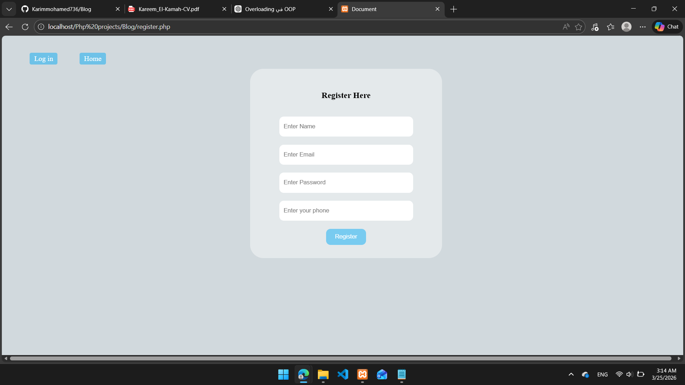
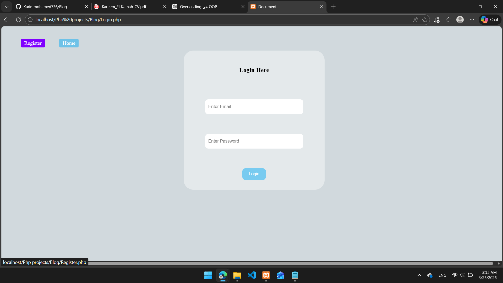
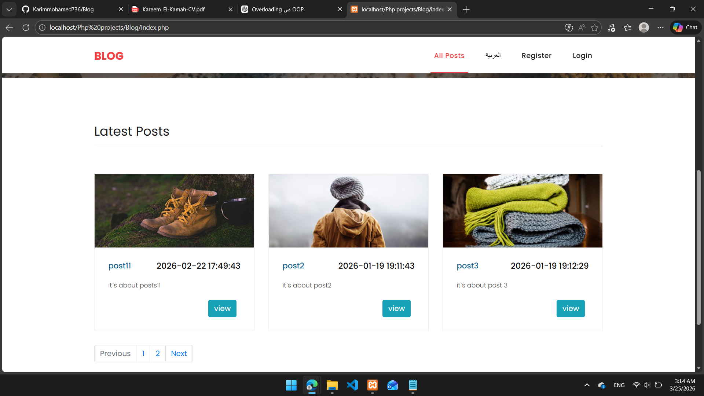
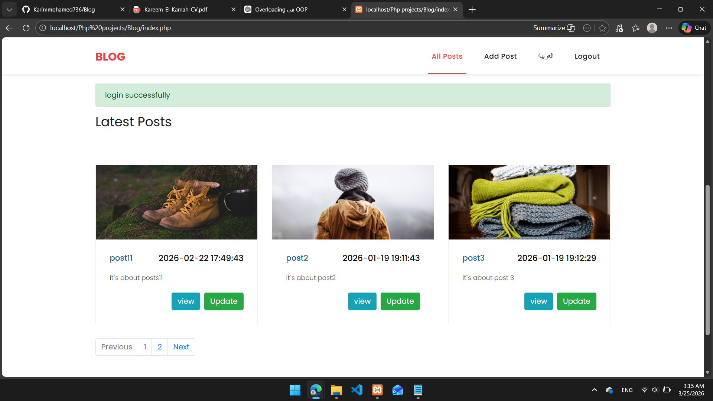
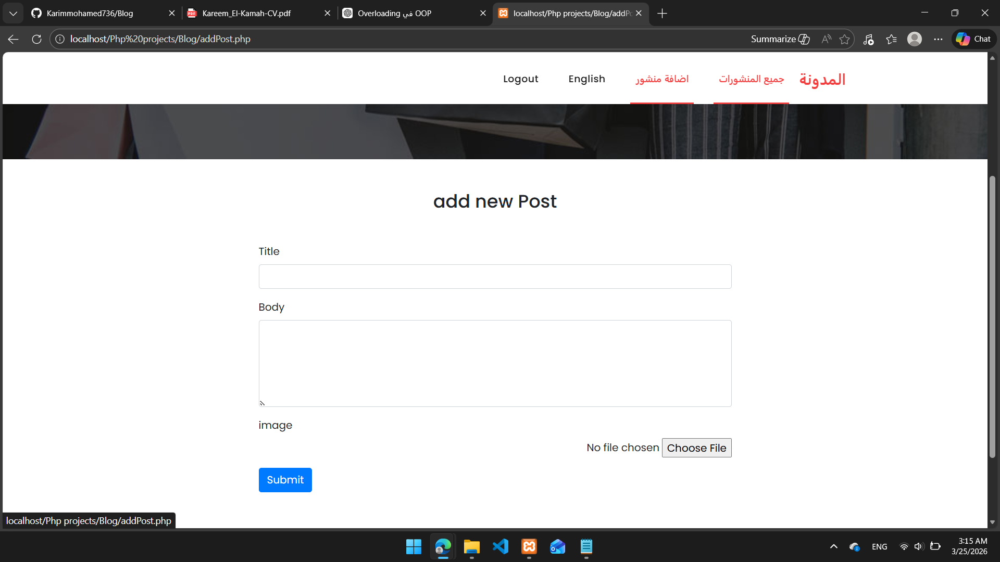
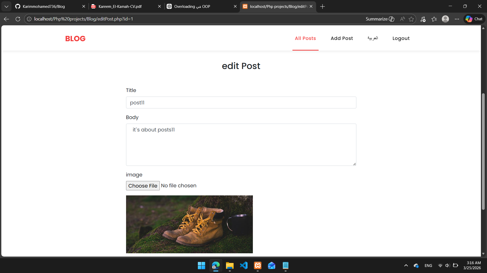
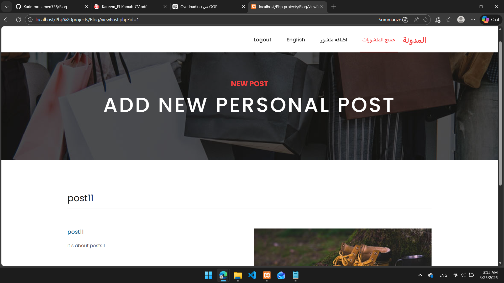
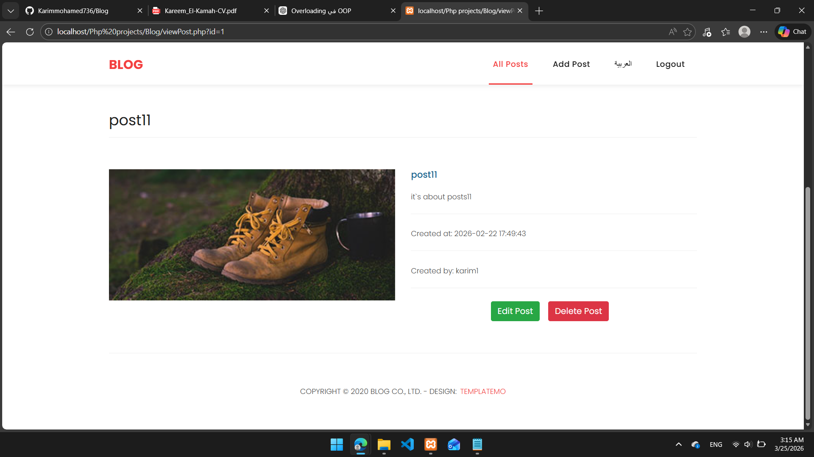

# 📝 Blog Management System
- A dynamic blog web application built using PHP & MySQL, featuring authentication, role-based authorization, and multi-language support (Arabic & English).

# 🚀 Features
- 👤 User Registration & Login System
- 🔐 Authentication (Session-based)
- 🛡 Role-Based Authorization (Admin / User)
- 📝 Create, Edit, Delete Posts
- 📖 Display Blog Posts
- 🌍 Multi-language Support (Arabic 🇪🇬 / English 🇬🇧)
- ✅ Server-side Validation
- 💬 Flash Messages System
- 🛡 Secure database handling

# 🧠 Key Highlights
- Implemented full CRUD operations
- Built complete authentication & authorization system
- Added multi-language support for better user experience
- Applied validation & secure coding practices
- Structured backend using clean and maintainable logic

# 🛠️ Technologies Used
- PHP
- MySQL
- HTML / CSS / Bootstrap

## 📂 Project Structure
- /assets      → CSS, JS, images
- /db          → Database connection
- /errors      → Error & success messages
- /handle      → CRUD & authentication logic
- /inc         → Shared components (header, footer)
- /uploads     → Uploaded images
- /vendor      → External libraries

- Login.php        → Login page
- register.php     → Register page
- index.php        → Home (all posts)
- addPost.php      → Add new post
- editPost.php     → Edit post
- viewPost.php     → View single post
- about.php        → About page
- contact.php      → Contact page
- steps.php        → Workflow page

## 📸 Screenshots
### 📝 Register

### 🔐 Login

### 🏠 User Home Page

### 🏠 Admin Dashboard 

### ➕ Add post

### ✏️ Update post

### 🌍 Language Selection

### 👁 View

# 🎯 Project Goal
To build a secure blog system from scratch focusing on:
Backend fundamentals
Authentication & Authorization
Clean code practices

## 👨‍💻 Author
Karim Mohamed